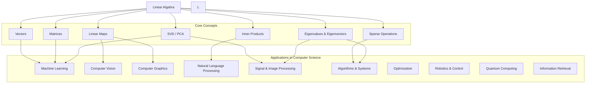

```mermaid
graph TB
  %% Core
  LA["Linear Algebra"]

  %% Core Concepts
  subgraph "Core Concepts"
    V["Vectors"]
    M["Matrices"]
    LM["Linear Maps"]
    IP["Inner Products"]
    EV["Eigenvalues & Eigenvectors"]
    SVD["SVD / PCA"]
    SP["Sparse Operations"]
  end

  LA --> V
  LA --> M
  LA --> LM
  LA --> IP
  LA --> EV
  LA --> SVD
  LA --> SP

  %% Applications
  subgraph "Applications in Computer Science"
    ML["Machine Learning"]
    CV["Computer Vision"]
    CG["Computer Graphics"]
    NLP["Natural Language Processing"]
    SIG["Signal & Image Processing"]
    SYS["Algorithms & Systems"]
    OPT["Optimization"]
    ROB["Robotics & Control"]
    QC["Quantum Computing"]
    IR["Information Retrieval"]
  end

  V --> ML
  M --> ML
  SVD --> ML
  SP --> SYS
  EV --> SYS
  LM --> CG
  LM --> CV
  IP --> NLP
  SVD --> SIG
  EV --> SIG
  L

```
