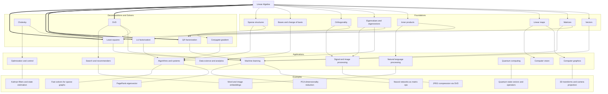

```mermaid
graph TB
  %% ===== Root =====
  LA["Linear Algebra"]

  %% ===== Foundations =====
  subgraph "Foundations"
    V["Vectors"]
    M["Matrices"]
    LM["Linear maps"]
    IP["Inner products"]
    EV["Eigenvalues and eigenvectors"]
    ORT["Orthogonality"]
    BASIS["Bases and change of basis"]
    SP["Sparse structures"]
  end

  LA --> V
  LA --> M
  LA --> LM
  LA --> IP
  LA --> EV
  LA --> ORT
  LA --> BASIS
  LA --> SP

  %% ===== Decompositions and Solvers =====
  subgraph "Decompositions and Solvers"
    SVD["SVD"]
    QR["QR factorization"]
    LU["LU factorization"]
    CH["Cholesky"]
    LS["Least squares"]
    CG["Conjugate gradient"]
  end

  EV --> QR
  M --> LU
  ORT --> QR
  IP --> LS
  SP --> CG
  SVD --> LS
  CH --> LS

  %% ===== Applications in Computer Science =====
  subgraph "Applications"
    ML["Machine learning"]
    CV["Computer vision"]
    CGR["Computer graphics"]
    NLP["Natural language processing"]
    SIG["Signal and image processing"]
    SYS["Algorithms and systems"]
    OPT["Optimization and control"]
    QC["Quantum computing"]
    IR["Search and recommenders"]
    DS["Data science and analytics"]
  end

  %% Links from foundations and solvers to applications
  V --> ML
  M --> ML
  LM --> CGR
  LM --> CV
  IP --> NLP
  EV --> SYS
  EV --> SIG
  SVD --> ML
  SVD --> IR
  QR --> ML
  LU --> SYS
  CG --> SYS
  LS --> ML
  ORT --> SIG
  BASIS --> DS
  SP --> SYS
  CH --> OPT

  %% ===== Concrete Examples =====
  subgraph "Examples"
    EX1["Neural networks as matrix ops"]
    EX2["PCA dimensionality reduction"]
    EX3["3D transforms and camera projection"]
    EX4["PageRank eigenvector"]
    EX5["JPEG compression via SVD"]
    EX6["Kalman filters and state estimation"]
    EX7["Quantum state vectors and operators"]
    EX8["Fast solvers for sparse graphs"]
    EX9["Word and image embeddings"]
  end

  ML --- EX1
  ML --- EX2
  CGR --- EX3
  SYS --- EX4
  SIG --- EX5
  OPT --- EX6
  QC --- EX7
  SYS --- EX8
  NLP --- EX9
  IR  --- EX9

  %% Optional grouping arrows for readability
  LA ==> SVD
  LA ==> QR
  LA ==> LU
  LA ==> LS

```
