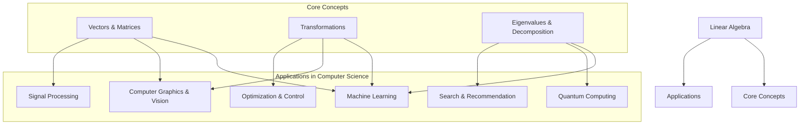

```mermaid
graph TD
  A["Linear Algebra"] --> B["Core Concepts"]
  A --> C["Applications"]

  subgraph Core_Concepts["Core Concepts"]
    D["Vectors & Matrices"]
    E["Transformations"]
    F["Eigenvalues & Decomposition"]
  end

  subgraph Applications["Applications in Computer Science"]
    G["Machine Learning"]
    H["Computer Graphics & Vision"]
    I["Signal Processing"]
    J["Optimization & Control"]
    K["Quantum Computing"]
    L["Search & Recommendation"]
  end

  D --> G
  D --> H
  D --> I
  E --> G
  E --> H
  E --> J
  F --> G
  F --> K
  F --> L
```
